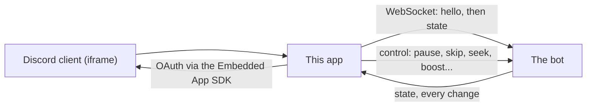

# Architecture

How the Activity is put together. For running it, see the [README](../README.md).

## Shape

A single-page React app, built by Vite, that Discord loads in an iframe when someone runs `/watch`. It
holds no playback of its own: the bot plays the audio in the voice channel, and the app is a live view
and remote control of that.

- **Sign-in.** The app asks the Discord SDK for an authorization code, the bot's endpoint exchanges it, and
  the app then sends its access token in a `hello` message. The bot decides who may drive playback.
- **State.** After `hello`, the bot pushes a `state` message on every change: the current track and its
  position sample, at most the first 50 queued tracks (and the real `queueLength`), volume, repeat mode,
  and whether listeners can boost. The app draws that and nothing else.
- **Controls.** Buttons send `control` messages (`pause`, `resume`, `skip`, `previous`, `seek`, `volume`,
  `jump`, `shuffle`, `loop`, `boost`). The bot re-checks permission on every one, so the `canControl` flag
  only decides whether the UI offers the buttons.
- **Position.** The bot sends a sampled position and a timestamp, and `useLivePosition` advances it locally
  between messages, freezing when the connection drops.
- **Profile and guild context.** `getProfile` and `getGuildContext` return the viewer's stats and this
  server's read-only settings for the Profile and Settings panels.

The types for all of this are at the top of `activity/src/useActivitySync.ts`. Unknown fields are ignored
and newer ones are optional, so an older bot keeps working.

## States

`useActivitySync` exposes a `SyncStatus`: `connecting`, `ready`, `stale` (the last state, frozen, with
controls disabled) and `error`. The player never shows a live-looking screen that isn't live.

## Mock mode

`?mock=1` replaces the Discord SDK and the socket with the fixtures in `mockSync.ts`. It exists so the
whole interface can be developed and screenshotted with no Discord application and no bot. It shows how a
screen renders, not how the connection behaves.

## Styling

All styles are in `player.css`, driven by CSS custom properties. The accent (`--vibe-accent`) is set per
instance and can be chosen by the user, so components must derive colours from it rather than hard-code the
brand colour. Backgrounds are `.vibe-backdrop--<key>` layers behind the frame. A user's background and
accent choices arrive in `prefs` on the state.

## Build constraints

Discord serves the app under a strict Content Security Policy: no inline scripts, no absolute cross-origin
URLs. Vite is configured to emit relative asset URLs, and fonts are bundled. `vite.config.ts` explains the
details.
